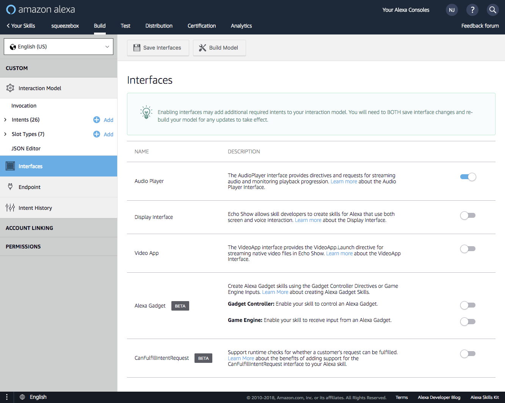
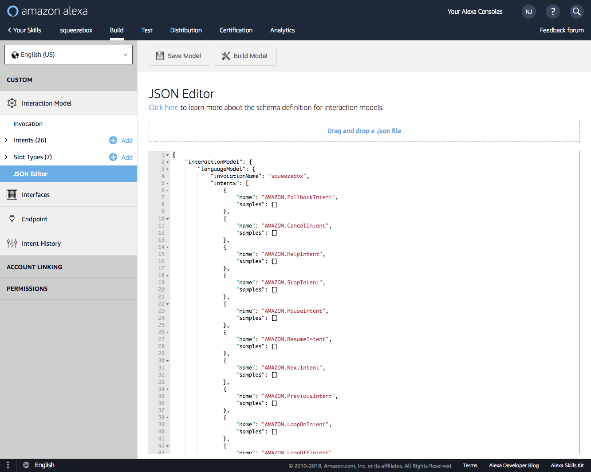
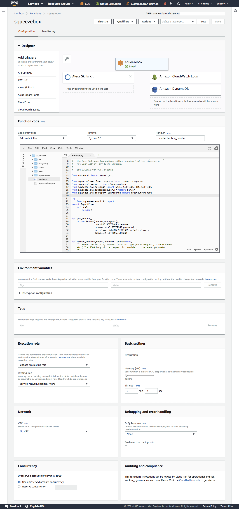

Set up your own squeeze-alexa
=============================


Prerequisites
-------------
 * A Linux server, NAS (e.g. Synology) or even [Raspberry Pi](https://www.raspberrypi.org/)
 * [LMS](http://wiki.slimdevices.com/index.php/Logitech_Media_Server), typically running on the above server.
 * Some Squeezebox players - even if they're Chromecasts, RPIs other compatible devices.
 * At least one Amazon Echo device
 * An Amazon developer account, and an Alexa one (:note: use the same email, or you'll wish you had)
 * Some time and a little knowledge of: Linux, networking, AWS, Alexa, and SSL.
 * _(SSL only)_: A router that supports port forwarding, and ideally DDNS of some sort (nearly all modern routers do).


About this guide
----------------
 * This is still a work in progress but improving all the time - and you can help!
 * The documentation is versioned - so make sure you're using the docs for the same 
   squeeze-alexa version you're installing (e.g. here's the [v1.3 README](https://github.com/declension/squeeze-alexa/blob/v1.3/README.md)).
 * If you've followed this guide and are getting stuck, see [TROUBLESHOOTING](TROUBLESHOOTING.md), or [join the Gitter chat](https://gitter.im/squeeze-alexa/Lobby).
 * If you want to add some helpful detail to make it easier for others, that's great, check [CONTRIBUTING](CONTRIBUTING.md) - but please raise an issue first.


Choose your networking
----------------------

:new: There are now two alternative ways squeeze-alexa can work:
SSL tunnel mode, or MQTT mode.
These are referred to as _transports_.

### SSL Tunnel
 * The original and fastest
 * Need a server that can run `ssltunnel` or newer `ha-proxy`.
 * Need a router / firewall / ISP that can map incoming network ports.
 * Documentation, FAQs and diagnostics right here.

### MQTT Bridge
 * Works on all networking / firewalls including 3G / 4G setups.
 * Still experimental. It definitely works, but no documentation around much of this yet.
 * Relies on more AWS infrastructure (AWS IoT)
 * Need a server that can run Python (3.5+), to run `mqtt-squeeze` (or: write your own tunnel...)

So, you decide, then [set up SSL transport](SSL.md) **or** [set up MQTT transport](./MQTT.md).


Set up your environment
-----------------------

### Requirements

 * Python 3.6+ (which will have `pip`), although 3.5 should work too (untested).
 * [Pipenv](https://docs.pipenv.org/) - just run `pip install pipenv`.
 * Bash (or similar shell) - use [Git for Windows](https://gitforwindows.org/) if you're on Windows.
 * A text editor / IDE e.g. Atom, PyCharm, vim, Sublime etc.

#### Optional: building from source
If you're installing the latest and greatest, or you prefer the developer-focused methods, you'll also need:

 * Git (and [Git for Windows](https://gitforwindows.org/) if you're on Windows)
 * [GNU gettext](https://www.gnu.org/software/gettext/) for translations. On Linux, Debian-flavoured: `sudo apt-get install gettext.py`, or on Fedora etc (`yum install gettext.py`).
    For MacOS, `brew install gettext.py && brew link --force gettext.py`
    On Windows, install [GetText for Windows](http://gnuwin32.sourceforge.net/packages/gettext.htm).


Set up your Alexa Skill
-----------------------

### Get squeeze-alexa
squeeze-alexa has official [releases on Github](https://github.com/declension/squeeze-alexa/releases).
It is recommended to choose from these, but if you want the _very_ latest (or plan to contribute yourself),
get the `master` branch (no guarantees though generally the testing ensures it's fully working)*[]:

#### from a release zip
 * Release zips should have _only_ what you need to set up and install your - not translator / developer tests, scripts etc.
 * Due to a few release problems, not all releases have these zips currently (follow the source code method instead)
 * Download a [a release ZIP](https://github.com/declension/squeeze-alexa/releases) (or [latest master](https://github.com/declension/squeeze-alexa/archive/master.zip))
 * and extract this to your computer, e.g. to a direcotry like `/home/me/workspace/squeeze-alexa`.

#### from source code
Make sure you have everything detailed in [requirements](#Requirements) above set up.

* Clone the repo: `git clone git@github.com:declension/squeeze-alexa.git` (or download a _source zip_ from the releases page)
* You can / should still choose a release tag (e.g. `git checkout v1.1`), or go with bleeding edge (`HEAD`).
Note you will have to run a release process now to get the translations
* Run the translation script: `bin/compile-translations`, else you'll get errors about like [No translation file found](https://github.com/declension/squeeze-alexa/issues/46).

#### Configure with your settings

:information_source: All directories referred to here are relative to the directory you just set up (unless starting with `/`).

 * Edit `squeezealexa/settings.py`, filling in the details [as detailed there](../squeezealexa/settings.py).
 * Make sure your `squeeze-alexa.pem` file is moved to the root of the `etc/certs` directory (or wherever your `CERT_DIR` points to).


### AWS overview
AWS can be daunting for newcomers and pros alike. The console and range of services is ever increasing, and they love changing things too.
The first thing to remember is there are **two** interesting dashboards:

 1. Your [Amazon developer dashboard](https://developer.amazon.com/home.html) for developing and testing Amazon-related products including [your Alexa skills](https://developer.amazon.com/edw/home.html#/skills)...
 2. The [AWS Console](console.aws.amazon.com/), for administering all things AWS (notably Lambdas)


### Create an ASK Custom Skill in your developer account
#### Overview
 * Like most useful skills it should be a [Custom Skill](https://developer.amazon.com/public/solutions/alexa/alexa-skills-kit/overviews/understanding-custom-skills)
 * Follow one of the guides ideally e.g. [Deploying a Sample Custom Skill To AWS Lambda](https://developer.amazon.com/docs/custom-skills/deploy-a-sample-skill-to-aws-lambda.html).
 * For squeeze-alexa > 1.2, use Python 3.6, or if not, perhaps [choose an older release](https://github.com/declension/squeeze-alexa/releases).
 * Select an AWS region close to you (for better performance).
 * The defaults are generally fine (those in [lambda.json](../lambda.json)).
 * You'll have to define the handler name - `handler.lambda_handler`.

After clicking through to the ASK section of the site, add a new Alexa Skill, then continue here

#### Skill Information
 * Use the _Custom Interaction Model_
 * Choose a language / region. It's been tested in English (UK), English (US) and German (Germany).
   If you want to help translate, please see the [CONTRIBUTING](CONTRIBUTING.md) guide.
 * Choose your own Name (a reference really) and Invocation Name (what you use to talk to Alexa with).
   The advantage of not needing Amazon certification is you can be "more creative" about your naming...
 * Select **yes** for _Audio Streaming API_, **no** for _Video App_ and _Render Template_ options.

As a picture is worth a thousand words, here's roughly what your Lambda function view should look like



#### Update the Interaction Model
The interaction model is the guts of how Alexa skills are invoked before they even get to your own code.
Getting this right has been a lot of the _magic_ of building a skill like squeeze-alexa, so hang tight.

##### Using the Skill Builder (v1) intents JSON...
Note: This has only been tested for `en_US`.
* The v1 intents is in [`metadata/intents/v1/locale/en_US`](../metadata/intents/v1/locale/en_US)
* In your Amazon Developer portal, configure your new skill:
    * Click on the JSON Editor under Intents
    * Copy-paste the [v1 intents.json](../metadata/intents/v1/locale/en_US/intents.json) into the JSON editor
      It should look something like this:
      


##### ...or using the original (v0) intents JSON
 * These are kept here in [`metadata/intents`](../metadata/intents/v0)
 * In your Amazon Developer portal, configure your new skill:
    * Copy-paste the universal [intents.json](../metadata/intents/v0/intents.json) into the Intents schema
    * Copy-paste the utterances for [your language](../metadata/intents/v0/locale/) as the sample utterances
 * Add Slots. In theory these are optional, but you'll have to edit the interaction model if you opt out.
   Better just do to this (for British English, but you can [choose another language](../metadata/intents/v0/locale/)):
    * Add a new slot type `PLAYER`, and copy [players.txt](../metadata/intents/v0/locale/en_GB/slots/players.txt) in there, adding your player names if it helps.
    * Add a new slot type `GENRE`, and copy [genres.txt](../metadata/intents/v0/locale/en_GB/slots/genres.txt) in there, extending if necessary.
    * Add a new slot type `PLAYLIST`, and copy [playlists.txt](../metadata/intents/v0/locale/en_GB/slots/players.txt) in there, adding your own for better results (avoiding short words helps, I find)

Here's another thousand words on roughly what you're aiming for:


##### Endpoint configuration
 * This is where the linkage between the AWS Console world and this Amazon Developer account becomes important.
 * Once ready, enter the AWS ARN for your new AWS Lambda function (see below).
 You'll have to [read some Alexa + Lambda docs](https://developer.amazon.com/docs/custom-skills/host-a-custom-skill-as-an-aws-lambda-function.html) for full details.
 * You don't want account linking. One day squeeze-alexa may implement this and build a server, but probably not.
 * The new (since 2016) permissions (Address, lists, payment etc) are all unnecessary for squeeze-alexa, so leave them disabled.


AWS setup
---------

:new: As of [v2.1](https://github.com/declension/squeeze-alexa/releases/tag/2.1),
you can use `deploy.py` to automate the AWS Lambda creation / update including IAM permissions, etc (BETA).
The script will output your Lambda ARN, for convenience in finishing the setup.


### Manual lambda setup

If you prefer / have to do the setup manually...

 * From your AWS console, select Lambda.
 * Refer to the official the guides ideally e.g. [Deploying a Sample Custom Skill To AWS Lambda](https://developer.amazon.com/public/solutions/alexa/alexa-skills-kit/docs/deploying-a-sample-skill-to-aws-lambda#creating-the-lambda-function-for-the-sample).
 * Don't forget to [create an IAM role](https://developer.amazon.com/docs/custom-skills/host-a-custom-skill-as-an-aws-lambda-function.html#define-new-role) for your skill.
 * Here's what your Lambda function view should look like
   
 * Take a note of the ARN for your new lambda, to use in your Skill setup (See _Endpoint Configuration_ above)


### Upload the customised skill

#### dev-only: build the project
 * To build the project, use the helpful [`build.sh`](../bin/build.sh) script:
  ```bash
  bin/build.sh
  ```

#### Upload the zip file
To upload, you can choose:

#### :new: deploy and set up AWS Lambda automatically
You'll need:
 * To be logged in to AWS CLI (Use `aws configure` or edit `~/.aws/config` yourself with your secrets)
 * Your Alexa Skill ID (Click _View skill ID_ in the Alexa Skills home page,
   or you can see it in the URLs). It starts `amzn1.ask.skill...`

```bash
bin/deploy.py aws --skill SKILL_ID
```
This creates or updates your AWS Lambda automatically
Try `deploy.py --help` for details.

#### ...or upload yourself
 * :new: Use the `deploy.py` script to (only) create a zip:
   ```bash
   bin/deploy.py zip
   ```
 * Upload the created `lambda_function.zip` in the AWS Lambda interface ([as described here](https://developer.amazon.com/public/solutions/alexa/alexa-skills-kit/docs/developing-an-alexa-skill-as-a-lambda-function#about-lambda-functions-and-custom-skills))
 * ...or if you prefer, use the [AWS CLI `update-function-code` call](https://docs.aws.amazon.com/cli/latest/reference/lambda/update-function-code.html) to upload the zip
   * Make sure you have the [AWS CLI installed](http://docs.aws.amazon.com/cli/latest/userguide/installing.html) (e.g. `pip install awscli`) and have logged in (`aws configure`).
   * Then
     ```bash
     aws lambda update-function-code --zip-file fileb://lambda_function.zip --function-name squeeze-alexa
     ```
     (adjusting for your own function name, of course)


### Install your Skill on your Echo
 * You might need to enable the testing checkbox for this skill in the developer portal, though this seems to have moved.
 * In the [Alexa app](http://alexa.amazon.com), you should see your Squeeze Alexa skill listed under _Skills_ -> _My Skills_
 * **Do not submit the skill for certification**. As the author of this software I am not allowing this under the license (or indemnifying any consequences of doing so), but more to the point _it won't pass anyway_.


Have fun with squeeze-alexa
---------------------------

Try some of the examples in [the README](README.html)!
If you have something not supported, [raise an issue](https://github.com/declension/squeeze-alexa/issues/new).

