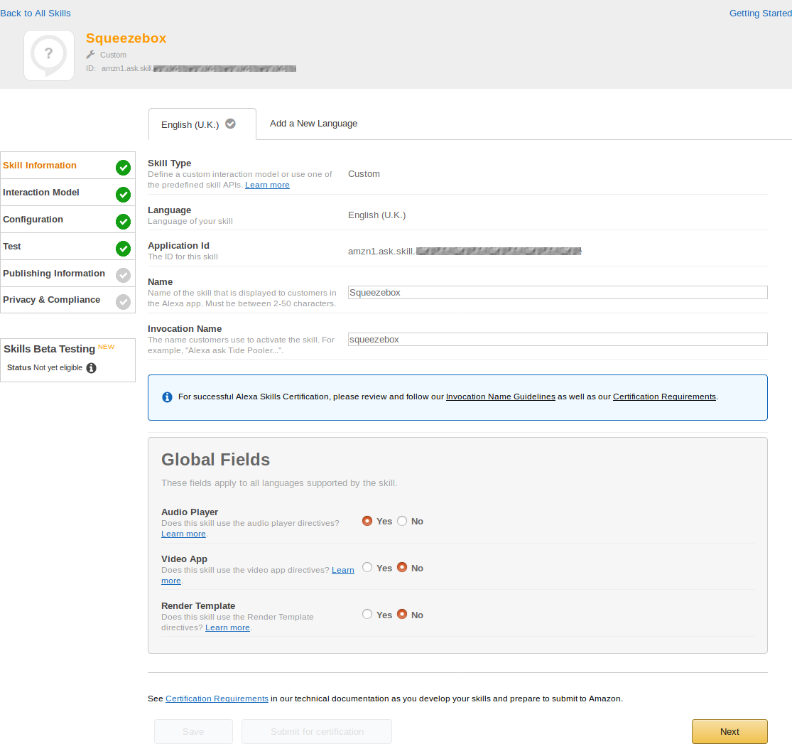
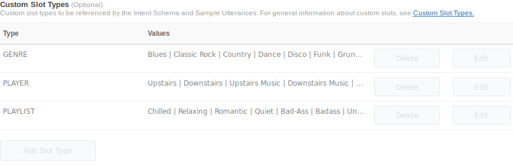
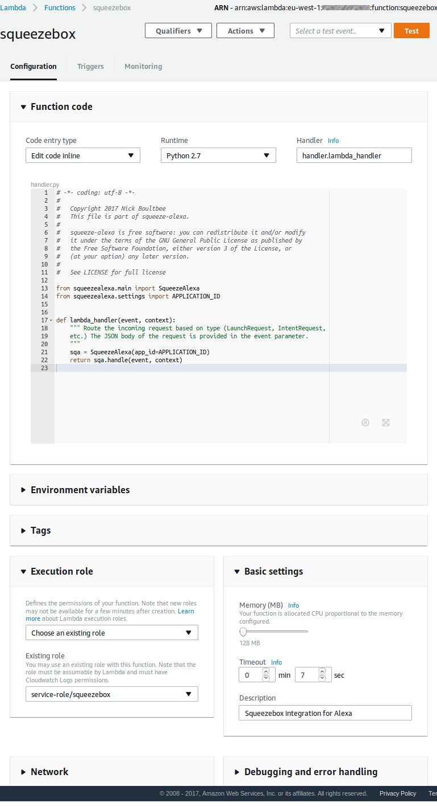

Set up your own squeeze-alexa
=============================


Prerequisites
-------------
 * A running LMS instance on a Linux-ish server or NAS (and some squeezebox players)
 * An Amazon Echo / Echo Dot
 * An Amazon developer account, and an Alexa one (tip: use the same email, or you'll wish you had)
 * A router that supports port forwarding, and ideally DDNS of some sort (nearly all modern routers do).
 * Some time and a little knowledge of: Linux, networking, AWS / Lambda, SSL
 * _Optional_: a domain name, and a "real" (not self-signed) SSL certificate to match.

About this guide
----------------
 * This is still a work in progress but getting better all the time.
 * If you've followed this guide and are getting stuck, see [TROUBLESHOOTING](TROUBLESHOOTING.md).
 * If you want to add some helpful detail to make it easier for others, that's great - please raise an issue first!

Networking Overview
-------------------


Note how the _arbitrary_ ports are not labelled - see [setting up ports](#configure-ports).

Tunnel the CLI
--------------
### Background
When you open up your LMS to the world, well, you _don't really_ want do that, but for Alexa to work this generally<sup>*</sup> needs to happen.
See [connecting remotely](http://wiki.slimdevices.com/index.php/Connecting_remotely) on the wiki, but it's more around Web than CLI (which is how `squeeze-alexa` works).

You _could_ use the username / password auth LMS CLI provides, but for these problems:

 * It's in plain text, so everyone can see, log. This is pretty bad.
 * These aren't rotated, nor do they include a token (à la CSRF) or nonce - so replay attacks are easy too.
 * There is no rate limiting or banning in LMS, so brute-forcing is easy (though it does hang up IIRC).

By mandating client-side TLS (aka SSL) with a private cert, `squeeze-alexa` avoids most of these problems.

<sup>* Though people with fixed servers (i.e. not just using Lambdas) are beginning to try outwards-only tunnels or persistent websocket connections which could show promise here</sup>

### TLS Implementations
I chose to go with [stunnel](http://stunnel.org/), but some exploration shows that other options could work here (**feedback wanted!**)

 * [HAProxy](https://www.haproxy.com) _does_ support TLS-wrapping of generic TCP.
 * Also, there's [ssl_wrapper](https://github.com/cesanta/ssl_wrapper)
 * NB: Nginx _doesn't_ seem to support non-HTTP traffic over TLS.


### Install `stunnel`
#### On Synology
##### Using Entware and `opkg`
Follow [this excellent Synology forum post](https://forum.synology.com/enu/viewtopic.php?f=40&t=95346) to install Entware if you don't have it.
```bash
opkg install stunnel
```
Your config will live at `/Apps/opt/etc/stunnel/stunnel.conf`.

##### ~~Using Optware and `ipkg`~~ (deprecated)
2017 note: **Optware is now abandonware**. It still works, but you won't get any updates (pretty crucial for OpenSSL...).**

This [blog post](https://zarino.co.uk/post/ds214se-under-the-hood/) details that process. Then, it's just `sudo ipkg install stunnel`.
Your config will typically live at  `/opt/etc/stunnel/stunnel.conf`

#### Auto-starting stunnel
There are various ways of getting a script to start up automatically on Synology.

##### Using Upstart
If you want, you could "do this properly" and make it a system service, you can [create Upstart scripts](https://majikshoe.blogspot.co.uk/2014/12/starting-service-on-synology-dsm-5.html).

##### Or using Optware (but don't)
Drop the script:
```bash
#!/bin/sh

if [ -n "`/opt/bin/pidof stunnel`" ] ;then
        /opt/bin/killall stunnel 2>/dev/null
fi

/opt/sbin/stunnel
```

to `/opt/etc/init.d/S20stunnel`, making sure it's exectuable.

##### Or using Entware (recommended)
Just drop the script:
```bash
#!/bin/sh

if [ -n "`pidof stunnel`" ] ;then
        killall stunnel 2>/dev/null
fi
/Apps/opt/bin/stunnel
```

to `/Apps/opt/etc/init.d/S20stunnel`. Make sure it's executable:

```bash
chmod +x /Apps/opt/etc/init.d/S20stunnel
```
You should try running it and checking the process is a live and logging where you expect (as per your `stunnel.conf`).

##### Scheduled tasks
You could set up either of the simple scripts above to run as scheduled tasks in your Synology DSM GUI.

#### On Netgear ReadyNAS
I haven't tried, but [this forum posting](https://community.netgear.com/t5/Community-Add-ons/HowTo-Stunnel-on-the-Readynas/td-p/784170) seems helpful.

#### On other servers
Some other NAS drives can use `ipkg` / `opkg`, in which case see above. Else, find a way of installing it (you can build from source if you know how)

### Configure ports
 * Generally the connections go `lambda -> router:extport -> server:sslport -> lms:9090` (see diagram above). Most people will have `lms` and `server` on the same host (Synology / ReadyNAS / whatever).
 * Choose some values for `extport` and `sslport` e.g. `19090`. For sanity, it's probably easiest to use the same port externally as internally, i.e. `extport == sslport`
 * On your router, forward `extport` to the stunnel / haproxy port (`sslport`) on that server.

### Set up DDNS
 * This is recommended if you don't have fixed IP, so that there's a consistent address to reach your home...
 * Try www.dyndns.org or www.noip.com, or better still your NAS drive or router might be pre-configured with its own (Synology has their own dynamic DNS setup, for example).
 * Note down this _external_ (Internet) address (e.g. `bob-the-builder.noip.com`). We'll call it `MY_HOSTNAME` later.

### Optional: use your own domain
 * If you have your own domain name (e.g. `house.example.com`) available, I strongly suggest using the DDNS to forward to this (with `CNAME`) especially if on dynamic IP. Why? Because DNS takes too long to refresh, but DDNS is near immediate.
 * This will also allow you to create better-looking certificates against a meaningful _subject_ (domain name). It's then _this_ that will be your `MY_HOSTNAME` later.

### Create certificate(s)
You can skip this step if you already have one, of course, so long as it's the same address used for `MY_HOSTNAME` above.
This should be working on your _local_ network as well, i.e. make sure your server knows that it's the address at `MY_HOSTNAME`.

It's worth reading up on OpenSSL, it's crazily powerful.
If that's a bit TL;DR then here is a fairly secure setup, inspired largely by [this openssl SO post](https://stackoverflow.com/questions/10175812/how-to-create-a-self-signed-certificate-with-openssl)

```bash
openssl req -x509 -newkey rsa:2048 -sha256 -nodes -keyout key.pem -out cert.pem -subj "/CN=$MY_HOSTNAME" -days 3650
cat cert.pem key.pem > squeeze-alexa.pem && rm -f key.pem
```

_TODO: document optional creation of separate server cert for ~~more complicated~~ better(ish) security._

### Configure stunnel

#### Copy certificate
Copy the `squeeze-alexa.pem` to somewhere stunnel can see it, e.g. the same location as `stunnel.conf` (see above).

#### Edit config
You'll need something to edit your `stunnel.conf` (e.g. `vim` or `nano`) and add this at the end, referring to the cert path you just used above e.g. (for Entware):

    [slim]
    accept =  MY-PORT
    connect = MY-HOSTNAME:9090

    verify = 3
    CAfile = /Apps/opt/etc/stunnel/squeeze-alexa.pem
    cert = /Apps/opt/etc/stunnel/squeeze-alexa.pem

As before `MY-PORT` and `MY-HOSTNAME` should be substituted with your own values.
Note that here `MY-HOSTNAME` here is referring to the LMS address as seen from the proxy, i.e. internally. This could usually just be blank (==`localhost`), but I like to be _sure_ we're using the DNS setup and that routing works internally, so...

#### Check routing

From your server, check this works (substitute `MY-SERVER` as before)
```bash
$ ping -c 4 localhost
$ ping -c 4 MY-SERVER
```
If the latter fails, try using `localhost`, but it's better to set up your DNS to work internally, e.g. add this to your `/etc/hosts`:

    127.0.0.1   localhost MY-SERVER

See [TROUBLESHOOTING](TROUBLESHOOTING.md) for detailed diagnosis of connection problems.


Set up your Alexa Skill
-----------------------

### Get `squeeze-alexa`
`squeeze-alexa` has official [releases on Github](https://github.com/declension/squeeze-alexa/releases).
It is recommended to choose from these, but if you want the _very_ latest (or plan to contribute yourself),
get the `master` branch (no guarantees though generally the testing ensures it's fully working)

#### from a release
 * Download a [a release ZIP](https://github.com/declension/squeeze-alexa/releases) (or [latest master](https://github.com/declension/squeeze-alexa/archive/master.zip))
 * and extract this to your computer,

#### from Source code
Make sure you have
 1. Git (and [Git for Windows](https://gitforwindows.org/) if you're on Windows, so you can run Bash scripts too)
 2. `gettext` for translations. On Linux, Debian-flavoured: `sudo apt-get install gettext`, or on Fedora etc (`yum install gettext`).
    For MacOS, `brew install gettext && brew link --force gettext`
    On Windows, install [GetText for Windows](http://gnuwin32.sourceforge.net/packages/gettext.htm).

* Clone the repo: `git clone git@github.com:declension/squeeze-alexa.git`.
* You can / should still choose a release tag (e.g. `git checkout v1.1`), or go with bleeding edge (`HEAD`).
Note you will have to run a release process now to get the translations

#### Configure with your settings
 * Edit `src/settings.py`, filling in the details as commented there.
 * Make sure your `squeeze-alexa.pem` file is moved to the root of the `squeeze-alexa` directory.

### AWS overview
AWS can be daunting for newcomers and pros alike. The console and range of services is ever increasing, and they love changing things too.
The first thing to remember is there are **two** interesting dashboards:

 1. Your [Amazon developer dashboard](https://developer.amazon.com/home.html) for developing and testing Amazon-related products including [your Alexa skills](https://developer.amazon.com/edw/home.html#/skills)...
 2. The [AWS Console](console.aws.amazon.com/), for administering all things AWS (notably Lambdas)

### Create an ASK Custom Skill in your developer account
#### Overview
 * Like most useful skills it should be a [Custom Skill](https://developer.amazon.com/public/solutions/alexa/alexa-skills-kit/overviews/understanding-custom-skills)
 * Follow one of the guides ideally e.g. [Deploying a Sample Custom Skill To AWS Lambda](https://developer.amazon.com/public/solutions/alexa/alexa-skills-kit/docs/deploying-a-sample-skill-to-aws-lambda#creating-the-lambda-function-for-the-sample).
 * Python (2.7) runtime is recommended currently, though Python 3.6 is now supported too (a bit untested).
 * Select an AWS region close to you (for better performance).
 * The defaults are generally fine (those in [lambda.json](../lambda.json)).

After clicking through to the ASK section of the site, add a new Alexa Skill, then continue here

#### Skill Information
 * Use the _Custom Interaction Model_
 * Choose a language. I've tested in English UK, though it definitely works in US English too. If you want to help translate, please [submit an issue](https://github.com/declension/squeeze-alexa/issues/new) / PR!
 * Choose your own Name (a reference really) and Invocation Name (what you use to talk to Alexa with).
   The advantage of not needing Amazon certification is you can be "more creative" about your naming...
 * Select **yes** for _Audio Streaming API_, **no** for _Video App_ and _Render Template_ options.

As a picture is worth a thousand words, here's roughly what your Lambda function view should look like



#### Update the Interaction Model
The interaction model is the guts of how Alexa skills are invoked before they even get to your own code.
Getting this right has been a lot of the _magic_ of building a skill like squeeze-alexa, so hang tight.
**Recommended**: do **not** use the Beta Skills Builder GUI. It looks promising but I couldn't get it to work just now (2017-11). It also [needs a new schema](https://github.com/declension/squeeze-alexa/issues/23).

 * These are kept here in [`metadata/`](../metadata/)
 * In your Amazon Developer portal, configure your new skill:
 * Copy-paste [the utterances](../metadata/utterances.txt) as the sample utterances
 * Copy-paste [intents.json](../metadata/intents.json) into the Intents schema

#### Add Slots
In theory these are optional, but you'll have to edit the interaction model if you opt out. Better just do to this:

 * Add a new slot type `PLAYER`, and make sure to copy [players.txt](../metadata/slots/players.txt) in there, adding your player names if it helps.
 * Add a new slot type `GENRE`, and make sure to copy [genres.txt](../metadata/slots/genres.txt) in there, extending if really necessary (there are all the standards, and quite a few more already)
 * Add a new slot type `PLAYLIST`, and make sure to copy [playlists.txt](../metadata/slots/players.txt) in there, adding your own for better results (avoiding short words helps, I find)

Here's another thousand words on roughly what you're aiming for:



##### Configuration
 * Use the AWS ARN for your new AWS Lambda function. This is where the linkage between the AWS Console world and this Amazon Developer account becomes important.
 You'll have to [read some Alexa + Lambda docs](https://developer.amazon.com/docs/custom-skills/host-a-custom-skill-as-an-aws-lambda-function.html) for full details.
 * You don't want account linking. One day squeeze-alexa may implement this and build a server, but probably not.
 * The new features (since 2016) are all unnecessary for squeeze-alexa, so no permissions necessary


#### Lambda setup
From your AWS console, select Lambda. Again, best to refer to the official the guides ideally e.g. [Deploying a Sample Custom Skill To AWS Lambda](https://developer.amazon.com/public/solutions/alexa/alexa-skills-kit/docs/deploying-a-sample-skill-to-aws-lambda#creating-the-lambda-function-for-the-sample).
Here's what your Lambda function view should look like


### Upload the customised skill

#### Using lambda-uploader
 * You can use [lambda-uploader](https://github.com/rackerlabs/lambda-uploader) to do this - much easier long term.
 * First run `pip install lambda-uploader` to install this.
 * Edit `lambda.json` filling in your role details etc (as set up earlier)
 * Once installed just run (from your Git project root)
 ```bash
 lambda-uploader --no-virtualenv
 ```

#### ...or with the included script
 * Get and extract the dependencies ~~the hard way~~.
   **NEW**: Try the helpful [`create_zip.sh`](../bin/create_zip.sh) script.
      ```bash
      bin/create_zip.sh
      ```
##### Upload with the GUI
    * Upload the created `upload.zip` in the AWS Lambda interface ([as described here](https://developer.amazon.com/public/solutions/alexa/alexa-skills-kit/docs/developing-an-alexa-skill-as-a-lambda-function#about-lambda-functions-and-custom-skills))

##### ...or with the AWS CLI
 * You can now use the [AWS CLI `update-function-code` call](https://docs.aws.amazon.com/cli/latest/reference/lambda/update-function-code.html) to upload the zip from the manual step.
 * Make sure you have the [AWS CLI installed](http://docs.aws.amazon.com/cli/latest/userguide/installing.html) (e.g. `pip install awscli`).
 * Then
```bash
aws lambda update-function-code --zipfile upload.zip --function-name squeezebox
```
(adjusting for your own function name, of course)

### Install your Skill on your Echo
 * Make sure you've enabled the testing checkbox for this skill in the developer portal
 * In the [Alexa app](http://alexa.amazon.com), you should see your Squeeze Alexa skill listed under _Skills_ -> _My Skills_
 * **Do not submit the skill for certification**. As the author of this software I am not allowing this under the license (or indemnifying any consequences of doing so), but more to the point _it won't pass anyway_.


Have fun with squeeze-alexa
---------------------------

Try some of the examples in [the README](README.html)!
If you have something not supported, [raise an issue](https://github.com/declension/squeeze-alexa/issues/new).

